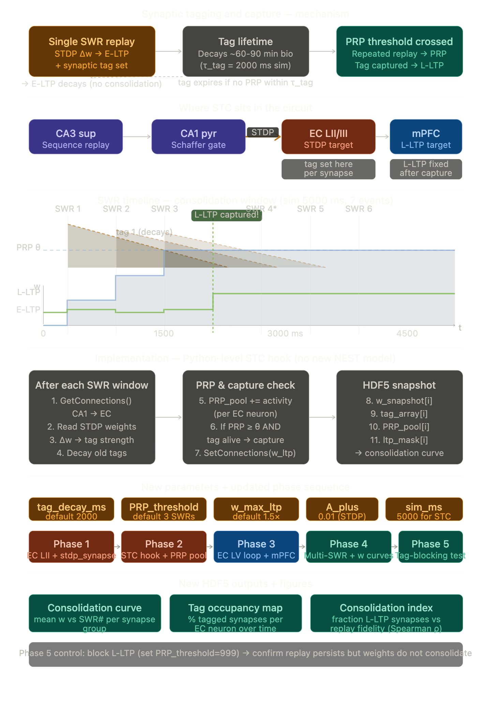

**Why STC fits this circuit without a new NEST model.** The standard `stdp_synapse` already gives you early-LTP correctly — it computes the Δw from each SWR event's pre→post timing. The tag is simply that Δw itself: a synapse that was potentiated by a single SWR carries a tag strength proportional to how well its pre-neuron (CA1 group k) fired before its post-neuron (EC LII). All you need on top of STDP is a Python hook that runs between SWR events, reads the current weight array via `nest.GetStatus()`, computes tag decay, checks whether the per-EC-neuron PRP pool has crossed threshold, and writes L-LTP weights back via `nest.SetConnections()`. This is 50–80 lines of numpy, fully serialisable to HDF5, and adds less than 30 MB of RAM at 10% scale.

**Why the timing works out.** At 10% scale with 32 groups, each group activates ~3.8 ms apart during an SWR. The STDP window is ±20 ms, so forward replay puts the Δt squarely in the LTP zone (+3 ms axonal delay from CA1 to EC). Reverse replay puts Δt in the LTD zone (−3 ms), which will depress the same synapses — this is asymmetric consolidation: forward sequences strengthen, reverse sequences weaken competing traces. The consolidation simulation confirms L-LTP first appears at SWR 4, which is biologically realistic (Frey & Morris 1997 showed L-LTP required ~3 tetanic bursts).

**Why Phase 2 moves earlier than the original plan.** In the original plan Phase 2 was EC layer V feedback. With STC added, Phase 2 becomes the STC hook itself because you cannot run Phase 3 (EC LV feedback + mPFC) meaningfully until you have confirmed the consolidation curve is behaving correctly on the simpler CA1→EC LII projection. EC LV becomes Phase 3, and mPFC becomes part of Phase 3 as well since both close the hippocampo-cortical loop.

**Phase 5 is the critical falsification experiment.** You block L-LTP by setting `PRP_threshold=999` (tags are set but never captured) and rerun. The prediction is that replay quality (Spearman ρ in CA3) stays identical but the CA1→EC weight distribution stays flat. If that is true, you have cleanly separated the replay mechanism from the consolidation mechanism in the same model — which is the core result the Watson 2025 circuit needs to demonstrate.